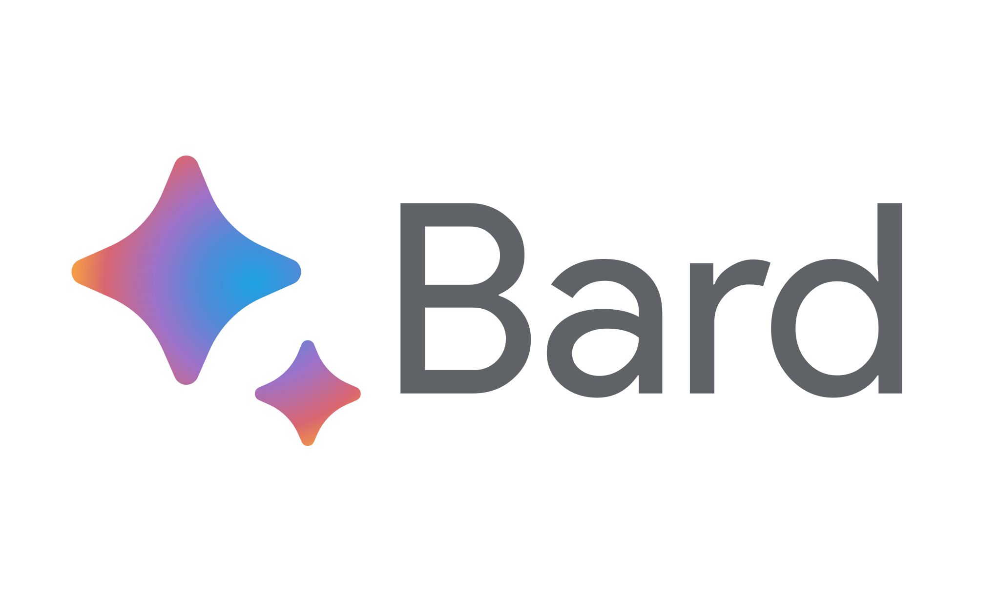

[*Bard*](https://bard.google.com/) is a conversational generative artificial intelligence chatbot developed by Google, based on the *PaLM 2 Large Language Model*.

The setup process for *Bard* is a more complicated than for *ChatGPT*, since *Bard* is not a standalone service, but a part of *Google Cloud*, which needs to be configured as well.
{:.notice--info}

*Vertex AI* is a unified AI platform that offers all AI services of *Google Сloud* under one roof. Among other things, it provides access to *Bard*.

In the context of {{ site.title_short }} we use "Bard" to refer both to the chatbot and the *Vertex AI* service.

Setting up *Bard* in {{ site.title_short }} consists of the following steps:

1. Set up a *Google Cloud project*.
1. Configure access to *Bard* from Unity.

Let's go through these steps in detail.

## Set up a Google Cloud project

First, you need to create a *Google Cloud project* and enable *Vertex AI API*. If you already have a project, you can skip the first three steps.

1. Go to [Google Cloud](https://cloud.google.com/) and click **Get started for free** or **Start free**.
1. Follow the instructions to specify a Google account and set up a billing account.
1. Go to the [Google Cloud Console](https://console.cloud.google.com/) and click on **My First Project**, which has been automatically created for you.
1. Copy the **Project ID** from the *Project info* section. In Unity, open *Project Settings > {{ site.title_short }}* and paste the ID into the **Project ID** field in the *Google Bard* section.
1. Enable *Vertex AI API*:
   1. Go to the [APIs & Services](https://console.cloud.google.com/apis/dashboard) page.
   1. Click **Enable APIs and Services**.
   1. Search for *Vertex AI API*, select it, and click **Enable**.

## Configure access to Bard

Now you need to set up access to the project from your Unity Editor.

1. Install the [Google Cloud SDK](https://cloud.google.com/sdk/docs/install) on your development machine. Follow the instructions for your operating system.
1. Provide the SDK installation path in Unity
   - *If you are using MacOS*, open *Project Settings > {{ site.title_short }}* and paste the *Google Cloud SDK path* into the **SDK Path** field in the *Google Bard* section. If you are not sure what the path is, simply click **Find SDK Path** on the settings page.
   - *If you are using Windows*, skip this step.
1. In Unity, open *Project Settings > {{ site.title_short }}* and click **Login Google Cloud SDK**. This will open a browser window where you need to log into your Google account and grant access to the *Google Cloud SDK*.
1. On the same Settings page, click **Login Google Auth Library**. This will open a browser window where you need to log into your Google account and grant access to the *Google Auth Library*, which is used to authenticate to the Google Cloud APIs.
1. Click **Get Access Token**. This will automatically fill in the **Access Token** field.
   - Access tokens expire after 1 hour, at which point you will need to click **Get Access Token** again. You can also click **Get Access Token** to get a new token before the current one expires.
1. Lastly, click **Test connection**. If everything is set up correctly, you will see a message with a greeting from *Bard*.

**Done!** You can now use *Bard* in your Unity project to generate scripts, explain code, chat with your AI assistant, etc.

{{ site.title_short }} does not access or store your Google Cloud credentials or any other information about your Google account. The only information that is stored (in encrypted form) is the access token, which is used to authenticate to the Google Cloud APIs.
{:.notice--info}
