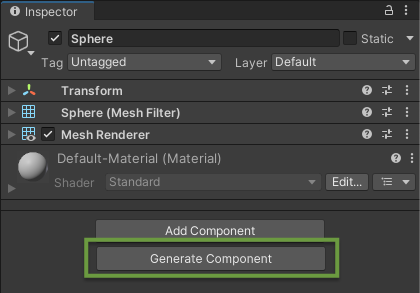
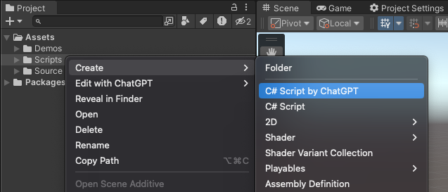

Once you [set up](/installation/) the ChatGPT Script Generator, you can start using it to generate C# scripts for your Unity projects.

## Using the ChatGPT Script Generator
After setting up the API key, you can now use the ChatGPT Script Generator in the Unity Editor:
1. In the Unity Editor, select a GameObject and click the **“Generate Component”** button in
the Inspector.
1. **Type a ChatGPT prompt** describing the C# script you would like to add.
1. Click **"Generate"**, and the script will be automatically created and added to your project.

{:.image-caption}
Press **Generate Component** button to open the prompt box

Alternatively, there is another option to open the prompt box for generating a script. Right-click in the **Project** tab ▶︎ select **Create** ▶︎ click **C# Script by ChatGPT**

## Important Notices
1. ⚠️ Please be aware that the API key is stored in the following file: `UserSettings/ChatGptScriptGeneratorSettings.asset`. When sharing your project with others, be sure to **exclude the "UserSettings" directory** to prevent unauthorized use of your API key.
1. Please be aware that ChatGPT, being an AI model, **may sometimes generate scripts that cannot be compiled** and will show errors in the Unity Console. While we strive to improve the accuracy and functionality of the generated scripts, we have no direct control over the AI's output.

## ChatGPT Script Generator Prompt Window

Type your request in the prompt window and click **"Generate and Add"** to generate a script. The generated script will be added to your project.

{:.image-caption}
The prompt window

## ChatGPT Script Generator Settings

The settings can be found in Edit ▶︎ Project Settings ▶︎ ChatGPT Script Generator.

### OpenAI API Key

- **API Key** is the field where you will need to paste your API Key, once it is generated [(here is more info on API Key generation)](/installation/#api-key-generation).

⚠️ The API key is stored in the following file: `UserSettings/ChatGPTScriptGeneratorSettings.asset`. When sharing your project with others, be sure to **exclude the "UserSettings" directory** to prevent unauthorized use of your API key.
{:.notice--warning}

{:.image-caption}
OpenAI API Key

### GPT Model

- **Model** is the GPT model that will be used to generate scripts. The default model is _gpt-3.5-turbo_.
- **OpenAI Documentation** opens the [OpenAI documentation](https://beta.openai.com/docs/developer-quickstart/1-introduction) in your browser.

{:.image-caption}
GPT Model

### Generation Settings

#### Temperature

- **Temperature** controls randomness: higher _Temperature_ results in more random completions. As the _Temperature_ approaches zero, the model will become deterministic and repetitive. Lower the _Temperature_ to get more or less the same results when you re-iterate the script generations, for example. Raise the _Temperature_ to get more diverse results upon each completion.

{:.image-caption}
Temperature parameter

#### Guiding Prompts

_Guiding Prompts_ are used to help the model generate scripts that are more relevant to your project.

- **+** and **-** buttons add and remove guiding prompts.
- **Reset to default** resets the guiding prompts to the default values.

{:.image-caption}
Guiding Prompts settings

#### Timeout

{:.image-caption}
Timeout settings

### General Settings

- **Output Path** is the path where the generated scripts will be saved. By default, it is set to `Assets/Scripts`.
- **Inspector button** toggles the _"Generate Component"_ button in the Inspector.

{:.image-caption}
General settings

### Prompt History

- **View History** shows the history of the prompts you have used to generate scripts in the current Unity project.

{:.image-caption}
History settings

### Useful Links

{:.image-caption}
Useful Links

## If You Have Issues
Please check the [Troubleshooting](/troubleshooting/) page, where the most common issues and their solutions are described. If you still have issues, please, [contact us](/contact-details/).

